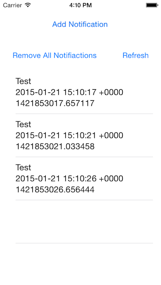
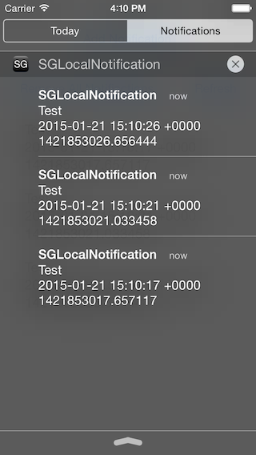
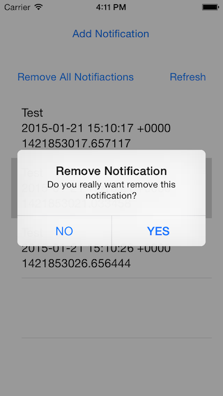
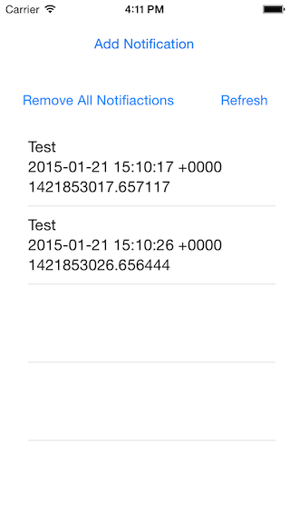
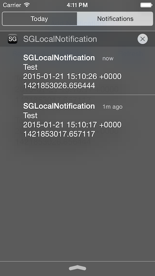

SGNotificationHelper
===================


**This helper can let you convert 'Remote Push Notification' to 'UILocalNotification', and let you manage the notifications which are already shown on Notification Center.**


***If you want to convert Remote notification and present it as Local Notification, Remote Notifiation must be 'Silent Notification' (otherwise remote notification will be shown on notification center)***


####* Note that all files are ARC only


# Sample Project Screens
**1. Add Notifications**



**2. Check Notifications on Notification Center**



**3. Select a raw on TableView and confirm to remove notification**



**4. Updated on TableView**



**5. Updated on Notification Center**




# INSTALL

## via git submodule

* Add it by git

```
 git submodule add https://github.com/SanggeonPark/SGNotificationHelper submodules/SGNotificationHelper
```
* Add the files you need to your xcode project.

## via Cocoapods

* Add the following line to your podfile (includes default files to your project aka UIKit and Foundation):

```
pod 'SGNotificationHelper'
```

# Publishing

1. Update `SGNotificationHelper.podspec`
2. Run `pod lib lint` to check for errors and 
3. Tag the version
4. `pod trunk push`

More infos :
* http://guides.cocoapods.org/making/using-pod-lib-create.html
* http://guides.cocoapods.org/making/getting-setup-with-trunk